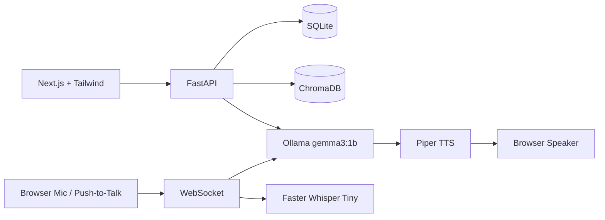

# Local AI Voice Interviewer

A lightweight, fully local AI interview platform for Windows 11 laptops with 8GB RAM and Intel integrated graphics. It uses only free and open-source components: Next.js, FastAPI, SQLite, ChromaDB, Ollama Gemma 3 1B, Faster Whisper Tiny, and Piper TTS.

## Architecture



## Features

- Resume upload for PDF and DOCX up to 20MB.
- Structured resume extraction for name, education, skills, projects, experience, and certifications.
- ChromaDB indexing for only skills, projects, and experience to reduce memory.
- Dynamic interview question generation through local Ollama Gemma 3 1B.
- WebSocket voice-interview flow with push-to-talk UI, live transcript, and conversation history.
- Internal answer evaluation and final report generation.
- JWT-ready authentication module and SQLite database models.
- No cloud services or paid APIs.

## 8GB RAM Optimization

- Uses Gemma 3 1B through Ollama for CPU-only inference.
- Uses Faster Whisper Tiny rather than larger Whisper models.
- Stores only high-signal resume sections in ChromaDB.
- Avoids loading multiple heavyweight models at the same time.
- Keeps Ollama context and output lengths small for question generation.

## Setup

### 1. Install Ollama and Gemma

Download Ollama from <https://ollama.com/download>, then run:

```bash
ollama pull gemma3:1b
ollama serve
```

### 2. Backend

```bash
python -m venv .venv
.venv\Scripts\activate  # Windows
pip install -r requirements.txt
uvicorn backend.main:app --reload
```

### 3. Frontend

```bash
cd frontend
npm install
npm run dev
```

Open <http://localhost:3000>.

### 4. Optional Piper TTS

Install Piper from its open-source releases and add the `piper` executable to PATH. Place desired male/female voice models locally and wire their paths in `backend/voice/pipeline.py` for production voice output.

### 5. Optional Faster Whisper Tiny

The dependency is included in `requirements.txt`. For lowest memory, initialize it lazily only when audio arrives and unload it after transcription sessions if needed.

## API Overview

- `GET /health` verifies local backend health.
- `POST /resumes/upload` accepts PDF/DOCX resumes and indexes resume content.
- `POST /interviews` creates an interview session.
- `WS /interviews/ws/{interview_id}` conducts the interview loop.
- `POST /reports/{interview_id}` creates the final report.

## Run with Docker

```bash
docker compose up --build
```

Docker is optional; native Windows installation is recommended for the lowest memory overhead.
